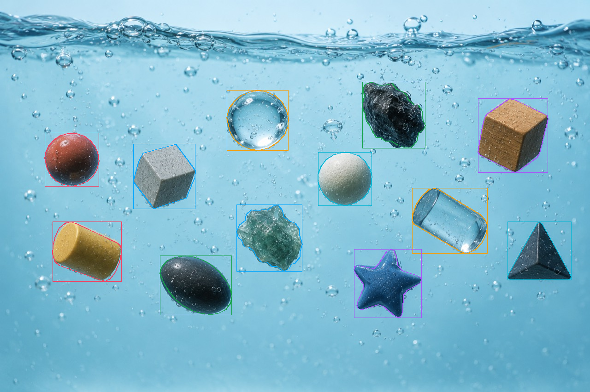
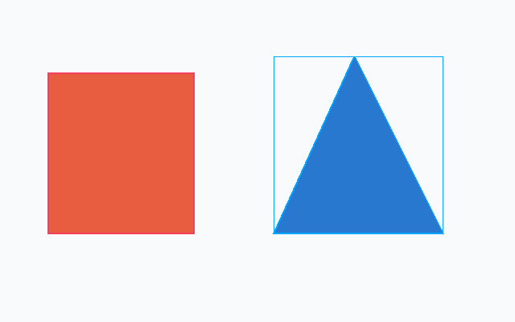

# LabelKit

**A local image-labeling CLI for vision-capable agents.**

Give an agent an image and a labeling task. The agent inspects the pixels and supplies scene labels, bounding boxes, and segmentation polygons. LabelKit validates the geometry, stores annotations, renders review images, and exports a training dataset in **COCO format by default**.

LabelKit does not call an LLM or infer object boundaries. Use it from Codex, Claude Code, Gemini/Antigravity, or any agent that can **open images and run shell commands**. Your chosen agent supplies the vision; LabelKit supplies the annotation tools.



Astra annotated the 12 prominent objects in this image using LabelKit: one annotation pass, one visual review, and no correction. The agent chose the geometry; LabelKit validated and rendered it. Boundaries remain approximate. [View the original image](docs/images/astra-photo-original.png).

## Contents

- [Install](#install)
- [Run the included example](#run-the-included-example)
- [Use with an agent](#use-with-an-agent)
- [Submission format and coordinates](#submission-format-and-coordinates)
- [Review and correct annotations](#review-and-correct-annotations)
- [Classifications, boxes, and polygons](#classifications-boxes-and-polygons)
- [Label folders and batch agent work](#label-folders-and-batch-agent-work)
- [Export COCO for training](#export-coco-for-training)
- [Detailed reviews and individual commands](#detailed-reviews-and-individual-commands)
- [Files, recovery, and limitations](#files-recovery-and-limitations)
- [Command reference](#command-reference)
- [Development](#development)

## Install

Requirements:

- Python **3.11 or later**. This checkout selects Python 3.14 through `.python-version`.
- [uv](https://docs.astral.sh/uv/getting-started/installation/). Git is only needed for installing from GitHub or working on the source.
- An image-capable agent with access to your image files and a shell, if you want the agent to label them.

Runtime dependencies are Pillow and Pydantic. LabelKit itself requires no API keys, model downloads, GPU, or labeling service. Your agent uses its own authentication and may send images to its model provider.

### Install with uv

Install from [PyPI](https://pypi.org/project/andesprit-labelkit/) without cloning, Git, or GitHub authentication:

```sh
uv tool install andesprit-labelkit
labelkit --help
```

The distribution name is `andesprit-labelkit`; the executable remains `labelkit`. PyPI's `labelkit` name belongs to an unrelated project. To update, run `uv tool upgrade andesprit-labelkit`. See [publishing instructions](docs/publishing.md) for future releases.

You can also install the tagged version directly from Git:

```sh
uv tool install 'git+https://github.com/Andesprit/labelkit.git@v0.4.2'
labelkit --version
labelkit --help
```

The command is **`uv tool install`**, not `uv install`. It installs an isolated CLI environment and puts `labelkit` on your executable path. A separate clone is unnecessary for this installation.

Only the Git installation requires an authenticated account with access to the private repository. The PyPI installation is public. If your shell cannot find the installed command, run `uv tool update-shell` and restart the shell. See uv's [tool installation guide](https://docs.astral.sh/uv/guides/tools/) for details.

Use `andesprit-labelkit` when installing from PyPI; `uv tool install labelkit` and `pip install labelkit` refer to a different project.

### Clone for the examples or development

```sh
git clone https://github.com/Andesprit/labelkit.git
cd labelkit
uv sync --locked
uv run labelkit --version
uv run labelkit --help
```

`uv sync` installs the development group as well, including pytest and pycocotools. To install only runtime dependencies, use `uv sync --locked --no-dev`, then `uv run --no-dev labelkit --help`.

From another directory, point uv at the checkout:

```sh
uv run --project /absolute/path/to/labelkit labelkit info /absolute/path/to/photo.jpg
```

You can also install the CLI from a local clone:

```sh
uv tool install .
labelkit --help
```

The rest of this README uses `uv run labelkit` from the checkout. Replace that prefix with `labelkit` after a tool installation, or with `uv run --project /absolute/path/to/labelkit labelkit` from another working directory. Shell examples use POSIX syntax; on PowerShell, use file-based JSON submissions rather than heredocs.

## Run the included example



Run these commands from a fresh clone. The example uses a bundled image and hand-authored annotations so you can verify the tooling without an LLM.

```sh
mkdir -p work/demo/input
cp examples/shapes.png work/demo/input/shapes.png

uv run labelkit task work/demo/input/shapes.png \
  --output work/demo/task \
  --instructions examples/shapes-task.txt \
  --categories examples/shapes-categories.json

uv run labelkit submit work/demo/task/task.json \
  --file examples/shapes-submission.json

uv run labelkit export work/demo/input --output work/demo/coco
```

Open `work/demo/task/view.png` before submitting to see the original, and `work/demo/task/pass1/view.png` afterward to review the outlines. The example produces two objects, each with a bounding box and polygon, plus one scene classification.

The submission file contains:

```json
{
  "classifications": [{"label": "geometric shapes"}],
  "objects": [
    {
      "key": "rectangle-1",
      "label": "red rectangle",
      "box": [60, 90, 240, 290],
      "polygon": [[60, 90], [240, 90], [240, 290], [60, 290]]
    },
    {
      "key": "triangle-1",
      "label": "blue triangle",
      "polygon": [[340, 290], [440, 70], [550, 290]]
    }
  ]
}
```

The triangle's box is derived from its polygon. These coordinates belong only to `examples/shapes.png`; an agent must inspect your images and choose new coordinates.

Output directories must be new. To repeat the example, use a new directory such as `work/demo-2` throughout, including a fresh copy of the image.

## Use with an agent

### Recommended workflow: task → submit → review → optional correction

1. Start a task for one image with `labelkit task`.
2. Open the returned `view` with the agent's image tool.
3. Submit all scene labels and objects together using `labelkit submit`.
4. Open the returned review `view` and check labels, omissions, boxes, and silhouettes.
5. If necessary, submit one corrected complete snapshot using the **new task handle**. Report unresolved uncertainty.
6. Export the image or its source folder as COCO.

Task views have the exact EXIF-oriented source dimensions: **no padding, rulers, grid, or resizing**. The original and reviewed images share one pixel coordinate frame. Thin annotation outlines are added for review; labels stay in JSON.

### Copyable agent prompt

Replace the paths and researcher instructions below. Supply the prompt to Codex, Claude Code, Gemini/Antigravity, or your preferred vision-capable agent:

```text
Use LabelKit at /absolute/path/to/labelkit to label
/absolute/path/to/images/photo.jpg.

Researcher task: classify the scene and label every prominent foreground
object with a tight bounding box and a polygon tracing its visible silhouette.
Exclude tiny background objects. Describe appearance and note uncertain identity.

Run commands with:
uv run --project /absolute/path/to/labelkit labelkit

Create a task in /absolute/path/to/work/photo-task with --geometry both.
Open the returned view with your image tool. Use its original pixel dimensions:
(0,0) is the top-left, x increases right and y increases down.

Submit classifications and objects as one complete JSON snapshot. Use stable,
unique object keys. A polygon alone can derive its enclosing bounding box.
Open the returned view once and check missing objects, wrong labels, clipped
silhouettes, excess background, and coordinate shifts.

If needed, make at most one correction using the NEW returned task handle,
retaining every unchanged object and class. Stop after that correction and
report uncertainty. If output is lost, use task-status on the initial handle.

Use your own vision. Do not call detectors or segmentation models, inspect
implementation code, or write crop/CLI helper scripts. LabelKit supplies those
operations. Export COCO to /absolute/path/to/work/photo-coco and report paths.
```

For reusable instructions, point your agent at [AGENTS.md](AGENTS.md) and [docs/agent-prompt.md](docs/agent-prompt.md). Explicitly ask it to read these files when working outside the checkout. An agent-specific integration or MCP server is not required.

### Supply research instructions and categories

```sh
uv run labelkit task /data/images/photo.jpg \
  --output /data/work/photo-task \
  --instructions /data/labeling-instructions.txt \
  --categories /data/categories.json \
  --geometry both
```

`--instructions` reads a plain-text file and stores it in the task packet. Give those instructions to the agent as well: the short CLI response does not repeat their contents. Free-form text cannot automatically enforce semantic choices such as which objects are prominent or how an occluded object should be labeled.

`--categories` reads a JSON array of allowed **object labels**, for example `["car", "person", "bicycle"]`. Scene classifications are independent. Category membership and geometry constraints are checked on submission.

## Submission format and coordinates

`submit` accepts a UTF-8 JSON file or stdin with `--file -`. Both top-level arrays are required, even when empty:

```json
{
  "classifications": [{"label": "outdoor", "note": null}],
  "objects": [
    {
      "key": "object-1",
      "label": "car",
      "box": [100, 80, 300, 220],
      "polygon": [[100, 140], [140, 80], [280, 80], [300, 220], [100, 220]],
      "note": "Identity is clear; far-side boundary is occluded."
    }
  ]
}
```

| Field | Meaning |
|---|---|
| `classifications` | Whole-image labels, each with `label` and optional `note`. |
| `objects` | All objects to retain in this image. |
| `key` | Stable, unique object identity across correction passes. |
| `label` | Object class or descriptive visual label. |
| `box` | `[x1, y1, x2, y2]` in original oriented pixels. |
| `polygon` | Ordered boundary vertices `[[x, y], ...]`; the closing edge is automatic. |
| `note` | Optional uncertainty or labeling rationale. |

Rules:

- Use finite pixel coordinates with `0 <= x <= width` and `0 <= y <= height`. Width and height represent outer edges; the last raster pixel index is one less.
- Boxes require `x1 < x2` and `y1 < y2`. A provided box must contain its polygon.
- Polygons require at least three distinct vertices, nonzero area, and no self-intersections. Do not repeat the first vertex at the end. Either winding direction is accepted.
- A polygon-only object automatically receives its enclosing box in the batch workflows.
- `--geometry both` and `--geometry polygons` require a polygon for each submitted object. `--geometry boxes` permits box-only objects; it does not forbid polygons.
- Classifications-only submissions use `objects: []`. The geometry mode does not require objects to exist.
- Keys identify individual objects. Two objects with the same label need different keys.
- Do not include hashes, revision strings, annotation IDs, or output paths in `submit` JSON. The task handle manages them.
- **A submission replaces the entire image snapshot.** Omitted objects and scene labels are removed. Retain unchanged objects/classes in every correction.

An image viewer may scale a large PNG. Always reason in the original dimensions returned by `task`; coordinates measured from a resized screenshot are not automatically corrected.

## Review and correct annotations

A successful submission returns a compact receipt resembling:

```json
{"status":"saved","task":"/data/work/photo-task/pass1/task.json","view":"/data/work/photo-task/pass1/view.png","objects":12,"passes_left":1}
```

Open that `view`, then submit a corrected full snapshot only if needed:

```sh
uv run labelkit submit /data/work/photo-task/pass1/task.json \
  --file /data/work/corrected-labels.json
```

Use the returned handle, rather than guessing paths. A second submission returns `passes_left: 0`. By default each task allows two successful submissions. Use `--max-passes 1` when creating a task to permit only one. Invalid submissions do not consume a pass.

If a command response is lost, recover the latest committed handle and view:

```sh
uv run labelkit task-status /data/work/photo-task/task.json
```

An identical retry against the same checkpoint replays its saved receipt while its saved revision remains current. A different payload against a consumed checkpoint requires the next handle. If another writer has changed the source or labels, stop and reconcile the change before creating a new task.

The pass limit applies to this task chain. It is not a limit on agent tool calls and does not prevent an agent from creating another task. State the desired review budget in your prompt.

## Classifications, boxes, and polygons

### Whole-image classification

For a single class addition:

```sh
uv run labelkit label /data/images/photo.jpg --label indoor \
  --note "Scene classification"
```

For complete snapshot replacement through a task, use:

```json
{"classifications":[{"label":"indoor"}],"objects":[]}
```

The latter removes any existing object annotations. Use the individual `label` command when you want to preserve them.

### Bounding boxes only

```sh
uv run labelkit task /data/images/photo.jpg \
  --output /data/work/boxes-task --geometry boxes
```

Ask the agent to supply boxes without polygons:

```json
{"classifications":[],"objects":[{"key":"car-1","label":"car","box":[50,30,250,180]}]}
```

Boxes need fewer coordinate values than polygons. Actual labeling time and accuracy depend on the agent and image; LabelKit does not promise a fixed number of model calls.

### Segmentation polygons

Use the default task mode and submit ordered silhouette vertices. Transparent objects, occlusion, small objects, and fine boundaries need an explicit researcher policy. LabelKit stores the polygon you supply; it does not infer missing details.

Export one stored polygon as a binary PNG mask:

```sh
uv run labelkit info /data/images/photo.jpg
# Copy a polygon's annotation id from the response, not its object_id.
uv run labelkit mask /data/images/photo.jpg \
  --id POLYGON_ANNOTATION_ID --output /data/work/object-mask.png
```

Masks contain 0 for background and 255 for foreground. PNG masks use Pillow rasterization; edge pixels may differ from COCO's polygon rasterization convention.

## Label folders and batch agent work

`task`, `submit`, and `review` operate on **one image at a time**. Folder traversal and model scheduling belong to the calling agent or your orchestrator. `export` accepts an entire source folder.

For a folder, ask your agent to:

1. Enumerate original source images, excluding previews, masks, and exports.
2. Create one task per image in separate output directories.
3. Open a manageable group of images if its image tool and model support that.
4. Submit one full snapshot per source image, then review each resulting view.
5. Export the annotated source folder once the group is complete.

An agent may group two independent submissions into one shell call:

```sh
uv run labelkit submit /data/work/image-a/task.json --file /data/work/image-a-labels.json
uv run labelkit submit /data/work/image-b/task.json --file /data/work/image-b-labels.json
```

These are separate image operations, not one atomic multi-image transaction. Check each command's result: the final shell exit status alone does not establish that both succeeded. Keep **one writer per source image**; concurrent agents can work on different images. Avoid stitching images unless your calling system also handles the coordinate mapping back to each source. LabelKit does not implement LLM batching or image-stitching inference.

## Export COCO for training

```sh
uv run labelkit export /data/images --output /data/datasets/labeled
```

COCO is currently the only built-in training format; `--format coco` is optional. Folder export discovers `*.labels.json` recursively and excludes images without sidecars. A direct image export may contain zero annotations.

```text
labeled/
├── annotations/
│   └── instances_default.json
├── images/
│   └── default/
│       ├── 000001.png
│       └── 000002.png
├── categories.json
├── classifications.csv
├── provenance.json
└── README.txt
```

- Point a COCO loader at `annotations/instances_default.json` and use **`images/default/` as its image root**. COCO `file_name` values are relative to that root.
- Each object exports as one record combining its box and optional polygon.
- COCO boxes are `[x, y, width, height]`; LabelKit converts them from its input `[x1, y1, x2, y2]` convention.
- Polygons export as COCO polygon segmentations with `iscrowd: 0`. Box-only records omit segmentation.
- Area is continuous polygon area when available, otherwise box area.
- Images export as PNGs in their EXIF-oriented annotation coordinate frame.
- Whole-image labels are stored in `classifications.csv`, since COCO instances do not represent scene classifications.
- `provenance.json` preserves original annotation IDs, object IDs, notes, hashes, and source paths. Account for those source paths when sharing an exported dataset.

### Keep category IDs stable across splits

Prepare a complete ordered vocabulary shared by all splits, such as `["car", "person", "bicycle"]`, then reuse it:

```sh
uv run labelkit export /data/train --output /data/datasets/train \
  --categories /data/categories.json
uv run labelkit export /data/validation --output /data/datasets/validation \
  --categories /data/categories.json
```

IDs start at 1 in the supplied order. Without a vocabulary, categories are sorted from the labels present in that export. You can reuse an emitted `categories.json`, provided it includes every label used by the later split. Missing labels are rejected. LabelKit does not invent train/validation/test splits.

For another format, use this COCO export as the interchange dataset for your training system or conversion tool. Conversion can only preserve information represented by its target format; whole-image classes and notes are separate files here.

## Detailed reviews and individual commands

For larger review budgets, `prepare` / `apply` / `review` expose the full packet, revision snapshot, coordinate grid, and paired original/annotated crops:

```sh
uv run labelkit prepare /data/images/photo.jpg \
  --output /data/work/prepared --instructions /data/instructions.txt
# Open original.png and read guide.txt; edit the returned annotations.json.
# Keep image_sha256 and base_revision when using apply.
uv run labelkit apply /data/images/photo.jpg \
  --file /data/work/prepared/annotations.json \
  --packet /data/work/prepared/packet.json --output /data/work/review-1
uv run labelkit review /data/images/photo.jpg \
  --packet /data/work/review-1/packet.json \
  --output /data/work/extra-review --per-page 2 --padding 0.25
```

`apply` accepts the full snapshot including `image_sha256` and `base_revision`; `submit` accepts only classifications and objects. Do not interchange these two JSON contracts.

Detailed views have padding and original-coordinate rulers. Read the ruler values for source coordinates. An advanced object `view_id` can instead select actual PNG canvas coordinates for a specific packet panel; the packet maps its `content_rect` into its `source_rect`. This requires the matching packet. Do not mix ruler values, canvas positions, and resized screen coordinates.

For an arbitrary detail, write a region file such as `[{"key":"detail-1","box":[100,80,300,220]}]`, then:

```sh
uv run labelkit review /data/images/photo.jpg \
  --regions /data/work/regions.json --output /data/work/detail-review
```

Small individual additions are also available:

```sh
uv run labelkit box /data/images/photo.jpg --label car --xyxy 50 30 250 180
uv run labelkit polygon /data/images/photo.jpg --label leaf \
  --points '[[25,40],[60,20],[90,45],[60,90]]'
uv run labelkit render /data/images/photo.jpg --output /data/work/preview.png
```

These commands add annotations by default. To edit an existing one, use its `--id` with the complete replacement geometry. To attach a second geometry to the same object, use its `--object-id`; to link existing annotations, use `labelkit link IMAGE --ids BOX_ID POLYGON_ID`. Equal class names never imply equal object identity. Use `remove IMAGE --id ANNOTATION_ID` to remove one annotation. Render again and inspect your edit.

## Files, recovery, and limitations

Annotations live next to each source as `photo.jpg.labels.json`. Version 2 sidecars store the source hash, oriented dimensions, annotations, and object identity. Version 1 files can be read, but known legacy box/polygon pairs must be linked explicitly before export. The original image is not modified.

Task directories contain source/review PNGs, internal packets and snapshots, task handles, and saved receipts. They use absolute paths and are working state, not a portable training format. Keep the image, sidecar, and task directory in place while a task is active. Use COCO export to move a dataset between machines.

Most operational errors are JSON on stderr with exit code `2`; successful results are JSON on stdout with exit code `0`. Argument-parsing failures use argparse's normal text usage message. Short task errors include a `code` and `recovery` hint.

| Problem | What to do |
|---|---|
| `VALIDATION_ERROR` | Fix the reported JSON/geometry issue and retry the same unconsumed handle. |
| `CHECKPOINT_USED` | Run `task-status` on the initial handle; use the latest returned handle for a different snapshot. |
| `TASK_CONFLICT` | Stop and reconcile source/annotation changes; do not reconstruct hashes to force an overwrite. |
| `PASS_LIMIT` | Stop this task and report uncertainty. Export remains available. |
| `IO_ERROR` | Check paths and access. Use absolute paths when the agent's working directory is uncertain. |
| Output already exists | Choose a new task, review, or export directory. `render` and `mask` can explicitly overwrite their PNGs with `--force`. |
| Annotation outlines are shifted | Recheck original oriented dimensions and whether coordinates came from a resized or padded image. |
| Folder export finds no sidecars | Annotate the source files first, then export the folder containing those files. |

Current scope:

- Single-frame raster images supported by Pillow; multi-frame images are rejected. No video labeling.
- Simple, single-component polygons. No holes, multipart instances, brushes, keypoints, or native RLE input.
- No inference engine, browser annotation editor, automatic model orchestration, dataset splitting, or built-in format conversion beyond COCO export.
- Revision checks protect against stale edits but are not a process lock. Serialize writes to the same image.
- Geometry validation does not verify object identity, completeness, class meaning, or pixel-perfect boundaries. Review the image and report uncertainty.

## Command reference

Run `uv run labelkit COMMAND --help` for full arguments.

| Command | Purpose |
|---|---|
| `task IMAGE --output DIR` | Prepare a short task with a source-sized image view. |
| `submit TASK --file JSON_OR_-` | Replace a complete annotation snapshot through a saved task handle. |
| `task-status TASK` | Recover the latest task handle and view. |
| `info IMAGE` | Read source metadata and current annotations. |
| `label IMAGE --label CLASS` | Add or update a scene classification. |
| `box IMAGE --label CLASS --xyxy X1 Y1 X2 Y2` | Add or update a bounding box. |
| `polygon IMAGE --label CLASS --points JSON` | Add or update a polygon; `--points-file` also accepts a JSON file. |
| `link IMAGE --ids ID ID` | Join existing geometries into one object. |
| `remove IMAGE --id ID` | Remove one annotation. |
| `render IMAGE --output PNG` | Render labels and geometries; optional `--grid PIXELS`. |
| `mask IMAGE --id ID --output PNG` | Rasterize a stored polygon as a binary mask. |
| `prepare IMAGE --output DIR` | Prepare full metadata, editable snapshot, and detailed views. |
| `apply IMAGE --file JSON --packet PACKET --output DIR` | Apply a complete revision-aware snapshot and render detailed reviews. |
| `review IMAGE --output DIR` | Render detailed review pages or custom regions. |
| `export IMAGE_OR_FOLDER --output DIR` | Export a COCO dataset. |

## Development

```sh
uv sync --locked
uv run pytest -q
uv build
```

The real CLI tests exercise validation, source orientation, stable object identity, correction passes, lost-response recovery, stale edits, masks, and COCO exports. pycocotools is a development dependency used to read exported datasets and decode segmentation masks; runtime annotation and export use Pillow and Pydantic.

```text
src/labelkit/
├── main.py          # CLI argument parsing and JSON responses
├── core/            # Annotation, task, workflow, and export entry points
├── modules/         # Geometry/snapshot handling, image views, COCO serialization
└── schemas/         # Pydantic contracts for sidecars, submissions, and packets
tests/               # Integration tests against the actual CLI
examples/            # Synthetic source image, instructions, and submission JSON
docs/                # Agent prompt and README image
```

Keep changes focused, add tests for behavioral changes, and run the suite before submitting a pull request. When changing CLI behavior, update the examples and agent instructions together. The experimental API is versioned as `0.x`; pin a tag or commit for reproducible installations.
