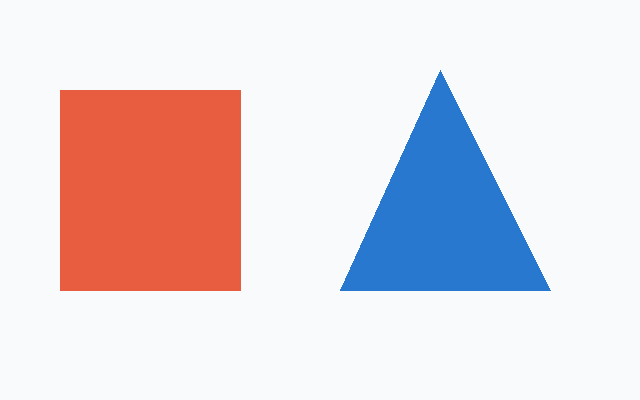

# Annotation evaluation

This is a reproducible **smoke benchmark**, not a model leaderboard. It contains one synthetic image with two known shapes, the design-coordinate reference, and preserved predictions from four earlier agent runs. Geometry and label correctness are scored separately.



## Reproduce the scores

From a checkout with [uv](https://docs.astral.sh/uv/getting-started/installation/):

```sh
uv sync --locked
uv run python benchmarks/main.py --check
```

This runs no models, requires no credentials, validates source/prediction hashes, and checks the computed scores against `results.json`. CI runs it on every PR. Omit `--check` to print scores without comparison. Runtime scoring functions live in `src/annolabel/modules/evaluation.py`; their behavior tests mirror that path in `tests/modules/test_evaluation.py`. `main.py` here is the repository-only research entrypoint, not an installed CLI command.

## Data and provenance

- Image: [examples/shapes.png](../examples/shapes.png), 640 × 400, created for this project and distributed under MIT.
- Reference: [reference.json](reference.json), constructed from the synthetic design geometry in [shapes-submission.json](../examples/shapes-submission.json). The rectangle is 180 × 200 coordinate units, so a square label is incorrect. These are design boundaries, not a hand-traced natural-image mask.
- Predictions: [predictions/](predictions/), archived final sidecars from the source-sized-view runs on 2026-09-09. Geometry, labels, object IDs, and notes are preserved. JSON has been reserialized for consistent formatting.
- Prompts: [prompts/](prompts/), the historical instructions with local repository/home paths replaced by `<REPO>` and `<HOME>`. Historical `labelkit` commands are deliberately preserved; replace them with `annolabel` for a new run. Prompt files contain no reference coordinates.
- Model identifiers, settings, hashes, passes, and timing scope: [manifest.json](manifest.json).

The reference has **not received independent human review**. Before using this as a validated research benchmark, have a person inspect the image, labels, and boundaries and record their review in [REFERENCE_REVIEW.md](REFERENCE_REVIEW.md). The earlier underwater-photo assistant annotations are not human ground truth and are excluded from these scores.

## Results on the synthetic image

| Recorded model | Box IoU | Mask IoU | Missed / extra objects | Wrong labels | Annotation passes |
|---|---:|---:|---:|---:|---:|
| gpt-6-astra | 100.00% | 100.00% | 0 / 0 | 0 / 2 | 1 |
| gpt-5.6-luna | 97.35% | 97.25% | 0 / 0 | 1 / 2 | 1 |
| claude-fable-5-1 | 100.00% | 99.41% | 0 / 0 | 1 / 2 | 1 |
| gemini-3.8-flash-high (requested) | 100.00% | 98.96% | 0 / 0 | 1 / 2 | 2 |

These are historical LabelKit 0.4.1 predictions rescored with the current evaluator, not fresh AnnoLabel 0.5.1 model runs. Gemini's resolved backend version was not recorded, so only its requested identifier is reported. The other identifiers come from recorded runtime metadata. Unknown settings and monetary cost remain null.

The original runs labeled **two images**, the synthetic image and an underwater photo. Their total wall times and tool counts therefore cannot be interpreted as time to label the shapes alone:

| Agent harness | Two-image wall time | Tool calls / operations |
|---|---:|---:|
| Codex / Astra | 101.448 s | 6 / 6 |
| Codex / Luna | 93.158 s | 5 / 7 |
| Claude Code via Atelier | 223.170 s | 7 / 7 |
| Antigravity via Atelier | 174.135 s | 7 / 7 |

An operation counts each image read or shell invocation; a wrapper can group operations into one model-visible call. Timers exclude parent preparation/export and can include final narration. Runs shared a host, some concurrently. No per-image latency or cost is inferred from these totals.

## Scoring method

The scorer validates sidecars and requires identical source hashes and oriented dimensions. It derives missing boxes from polygons, then greedily matches objects by descending box intersection-over-union (IoU), ignoring labels, at IoU ≥ 0.5. Ties are deterministic by object key. This is a small-fixture diagnostic, not COCO AP or optimal bipartite matching.

Box IoU uses continuous coordinate areas. Mask IoU uses the package's Pillow polygon rasterizer, including its boundary-pixel convention; it is **not** pycocotools rasterization and may differ at edges. Unmatched reference objects receive zero in the mean. A missing predicted polygon receives zero against a polygon reference. Box-only references are excluded from segmentation means. Missed and extra objects are reported separately; extra detections do not silently disappear, but do not reduce the reference-averaged IoU itself.

Label correctness is exact equality after the fixed, shared [alias table](aliases.json). It permits documented spelling/color-description variants such as `orange-red rectangle` → `red rectangle`; it never maps a square to a rectangle. The alias table was written after inspecting these historical runs, so this semantic score is exploratory. Freeze it before collecting future predictions. Whole-image classifications are retained in the raw predictions but are not scored.

## Run a new comparison

1. Copy only the source image into a new per-model directory; do not expose this directory's reference, predictions, results, or example submission to the agent. Prepare a new task with `annolabel task IMAGE --output NEW_DIR`.
2. Use the same [agent prompt](../docs/agent-prompt.md) and researcher instructions for every model. Ask for all shapes, descriptive labels, tight boxes, and visible-silhouette polygons. Record exact prompt text and resolved model/version/settings before the run.
3. Allow one initial submission, one visual review, and at most one complete correction. Record unsuccessful calls as well as successful submissions, and preserve final sidecars without parent repairs.
4. Record wall time, tool calls, operations, and passes with their scope. Preserve missing metadata as null. Score only after the run; the pure `compare_documents` function accepts validated sidecars and the frozen alias table.
5. For publishable comparisons, use multiple independent runs and a larger licensed dataset with human-reviewed natural-image references. Include occlusion, transparency, thin structures, crowded scenes, edge-touching objects, varied resolutions, and empty scenes. Publish distributions of scores/times and failures rather than selecting the best run.

This fixture demonstrates coordinate and semantic failure modes. It cannot establish general accuracy, model rankings, throughput, or training-data suitability.
